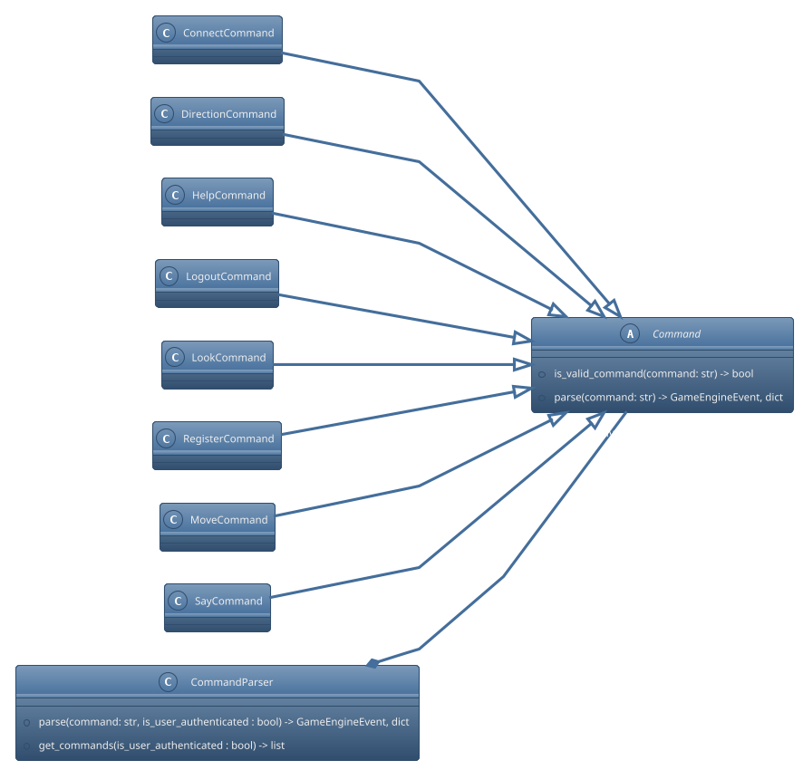

# Command handler design

The commands modules consists of multiple commands and a command parser. The command parser is responsible for parsing the commands from the user. The command parser contains the list of commands that can be accessed by an anonymous/authenticated user.

