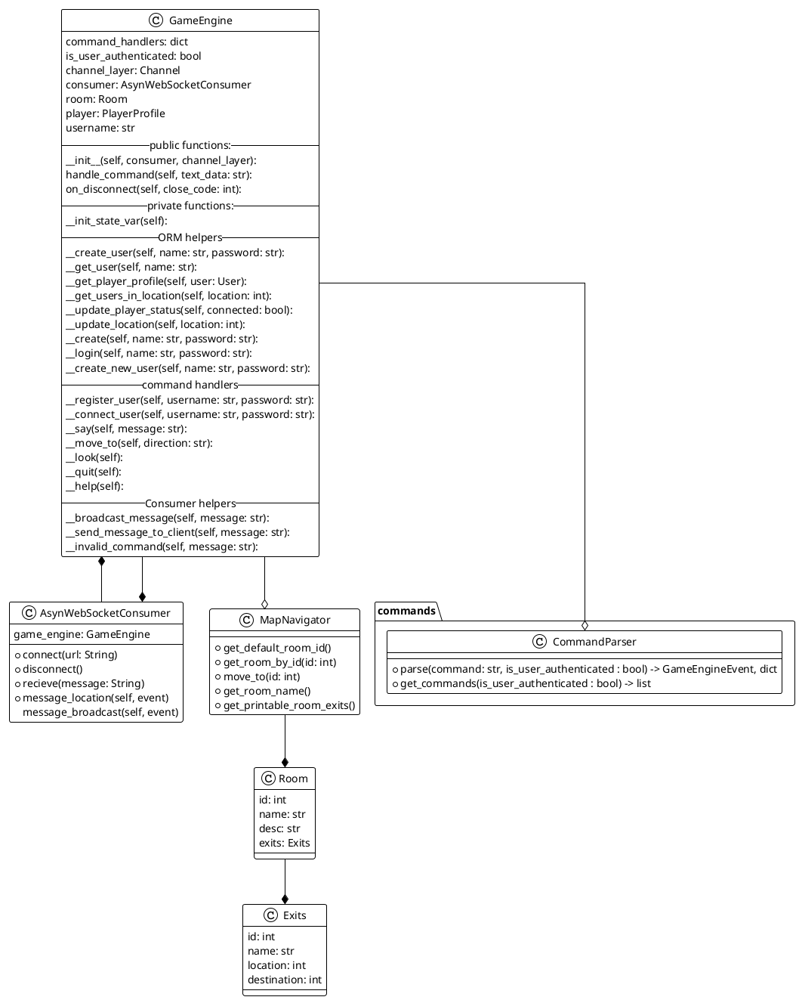

# Game engine/state design

The game engine has a one to one association with the AsyncWebSocketConsumer. The AsyncWebSocketConsumer is the class that handles the connection between the server and the client. The AsyncWebSocketConsumer is responsible for handling the messages from the client and sending the messages to the server.

The game engine does not have a tick mechanism. The game engine is designed to be run asynchronously. The game engine is responsible for handling the events from the user.

The game engine has a client-attorney pattern with the AsyncWebSocketConsumer.

