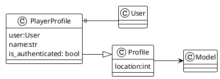

# Game profile design

All the game profiles derive from the base class Profile which is inherited from the Model class.

The PlayerProfile class is the profile of the player. The PlayerProfile class is responsible for storing the player's room id. It has one to one association with the User class.

Can be extended to store the player's inventory, room data, etc.

